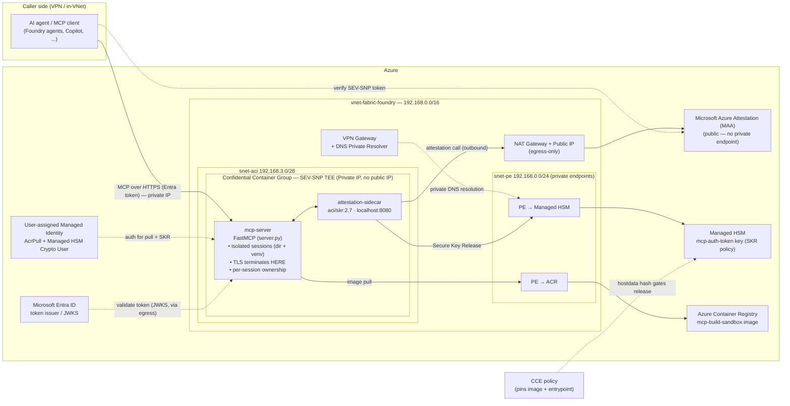

# Architecture

A confidential code-interpreter that an AI agent drives over **MCP**. The agent
stays outside; code executes inside an **Azure Container Instances confidential
container group** (AMD SEV-SNP TEE), so work is memory-encrypted, hidden from the
host/operator, and provable via attestation.

## Diagram (VNet-injected deployment)

Deployed **into an existing secured VNet** (`vnet-fabric-foundry`, 192.168.0.0/16).
The container group gets a **private IP only** — no public IP. Callers reach it
from inside the VNet or over the VPN gateway. Secrets are passed as secure
deployment parameters (the org policy forces Key Vault to private-only, so the
standard Key Vault is bypassed).

Everything inside the **TEE** box is memory-encrypted and hidden from the Azure
host/operator. TLS terminates *inside* the enclave, and the bearer key only
leaves the HSM after attestation succeeds.

### Network design notes

- **No public IP on the group.** In a VNet, a confidential container group gets a
  private IP only; the MCP endpoint (`https://<private-ip>:8000/mcp`) is reachable
  from inside the VNet or over the VPN gateway.
- **Dedicated delegated subnet** `snet-aci` (192.168.3.0/28), delegated to
  `Microsoft.ContainerInstance/containerGroups`.
- **NAT gateway (egress-only public IP).** A VNet-injected ACI group has no default
  outbound; a NAT gateway is the supported egress path. Its public IP is
  **outbound-only** (no inbound listener) and is needed because **Microsoft Azure
  Attestation has no private endpoint**, so the attestation call must egress. The
  VNet has no existing firewall/UDR egress, so NAT gateway is the best fit.
- **Private endpoints** for Managed HSM (`privatelink.managedhsm.azure.net`) and
  ACR (`privatelink.azurecr.io`, zone already present) keep key release and image
  pulls on the private network.
- **Key Vault bypassed.** Org policy `KeyVault_PublicNetwork_Modify` forces the
  standard Key Vault private-only; instead the ACR password and TLS cert/key are
  passed as `securestring` deployment parameters.

## Components

### In the repo

| Component | File | Role |
|---|---|---|
| MCP server | `mcp-build-sandbox/server.py` | FastMCP app: session mgmt + code-exec tools, in-enclave HTTPS, ownership enforcement, auth middleware |
| Container image | `mcp-build-sandbox/Dockerfile` | Python toolchain + server |
| Dependencies | `mcp-build-sandbox/requirements.txt` | Python packages |
| ARM template | `deploy/template.json` | Confidential ACI group (`sku: Confidential`, `ccePolicy`), 2 containers |
| Parameters | `deploy/parameters.json` | Key Vault secret refs, managed identity, HSM/MAA endpoints, Entra audience |
| SKR policy | `deploy/skr-release-policy.json` | Binds key release to SEV-SNP MAA claims + CCE hash |
| Deploy script | `deploy/deploy.ps1` | Build → secrets → SKR key → `acipolicygen` → deploy |

### Runtime containers (in the group)

- **`mcp-server`** — the code interpreter; TLS terminates here.
- **`attestation-sidecar`** — `mcr.microsoft.com/aci/skr:2.7`, performs attestation
  and Secure Key Release at `localhost:8080`.

### Azure resources

- **VNet** `vnet-fabric-foundry` (existing, 192.168.0.0/16) — target network.
- **Delegated subnet** `snet-aci` (192.168.3.0/28) — delegated to
  `Microsoft.ContainerInstance/containerGroups`; hosts the confidential group.
- **NAT gateway + public IP** — egress-only outbound for the ACI subnet (needed for
  the MAA attestation call, which has no private endpoint).
- **NSG** on `snet-aci` — restricts traffic to/from the group.
- **ACR** — image registry, reached via **private endpoint** (`privatelink.azurecr.io`).
- **Managed HSM** — holds the attestation-gated bearer key, reached via **private
  endpoint** (`privatelink.managedhsm.azure.net`).
- **User-assigned Managed Identity** — AcrPull + Managed HSM Crypto User.
- **Confidential ACI group** — the SEV-SNP enclave; **private IP only, no public IP**.

Secrets (ACR password, TLS cert/key) are passed as `securestring` deployment
parameters rather than Key Vault references, because org policy
`KeyVault_PublicNetwork_Modify` forces the standard Key Vault to private-only.

### External Azure services (referenced, not deployed)

- **Microsoft Azure Attestation (MAA)** — verifies SEV-SNP; gates SKR. Public
  service (no private endpoint) — reached via the NAT gateway.
- **Microsoft Entra ID** — issues/validates caller tokens (production auth).
- **CCE policy** — generated by `az confcom acipolicygen`; pins the exact image/entrypoint.

### MCP tools exposed by the server

- **Sessions:** `create_session`, `list_sessions`, `delete_session`
- **Per-session:** `write_file`, `read_file`, `list_dir`, `run_python`, `pip_install`,
  `run_command`, `run_tests`, `git_clone`
- **Attestation:** `get_attestation`
